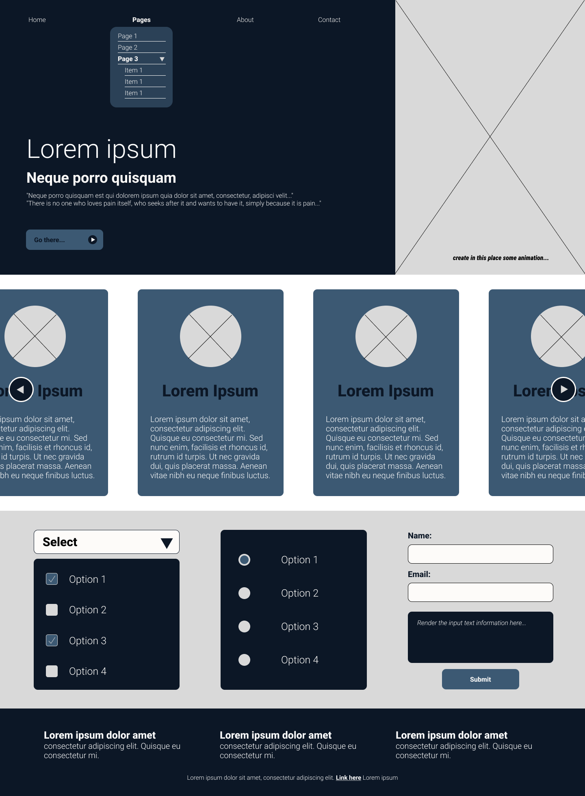

# Proyecto Frontend - Nombre Apellido

## Diagramacion

## Intro
La prueba deberá desarrollarse en React. Es libre de utilizar la Build Tool de su preferencia.

## Intrucciones

- El nombre del repositorio deberá tener la siguiente estructura: **nombre_apellido_prueba_frontend**
- Cree una rama develop que contenga la informacion de su app, no realice la prueba directamente en la rama main (master)

## Requerimientos
1. Cree un header que contenga un menú de acuerdo a la diagramación. Los botones deberán generar un evento Hover en CSS según la diagramación.
2. El espacio señalado en el banner debera tener una animación. No utilice librerias.
3. El botón de "Pages" deberá desplegar un menú de acuerdo a la diagramación.
Anidado en el menú desplegable de "Pages", deberá existir un botón que despliegue una lista de ítems (Item 1, Item 2, Item 3).
4. El botón del banner ("Go There") deberá tener una animación ya sea en el evento click o en el hover. Deberá imprimir por consola ("Go There") al dispararse el evento click.
5. Cree las cards de acuerdo a la diagramación propuesta.
El contenido de cada card deberá renderizarse por medio de un objeto. Es libre de crear la estructura del mismo. Se propone (img, title, content).
Las cards deberán encontrarse en un slide infinito. Puede implementar la biblioteca de su preferencia para este punto en particular.
6. Cree un input select de acuerdo a la diagramación.
7. Cree un input radio de acuerdo a la diagramación.
8. Cree un formulario que imprima los valores de los inputs en el campo señalado.
9. Cree el pie de página.
El pie de página deberá contener un enlace que imprima por consola (footer link) al dispararse el evento click.
10. Deberá ser responsive. El diseño deberá conservar el concepto, pero usted es libre de diseñar la vista para dispositivos tablet y mobile.

**Responsivo:**
- Desktop (+1024px)
- Tablet (768px - 1024px)
- Móbile (320px - 768px)

**Recomendaciones:**
- Es de vital importancia que maneje el paradigma de la biblioteca React (paradigma orientado a componentes); es decir, procure la correcta componentización de la app.
- Es sumamente importante el diseño responsivo de la app.
- Es un plus si implementa la libreria proptypes.
- Es un plus si utiliza un preprocesador de CSS como SASS (opcional).
- Evitar el uso de Bootstrap o Tailwind, excepto para el punto 3 (slide infinito).
- Verifique la correcta compilación de la aplicación.
- Realizar al menos 5 commits.
- Incluir comentarios necesarios en el código.
- Puede desplegar el proyecto en el host de su preferencia, sin embargo, lo más importante será el código (opcional).

**Colores:**
- #0C1726
- #3C5973
- #8C8377
- #FFFFFF

**Fuente:**
- Roboto